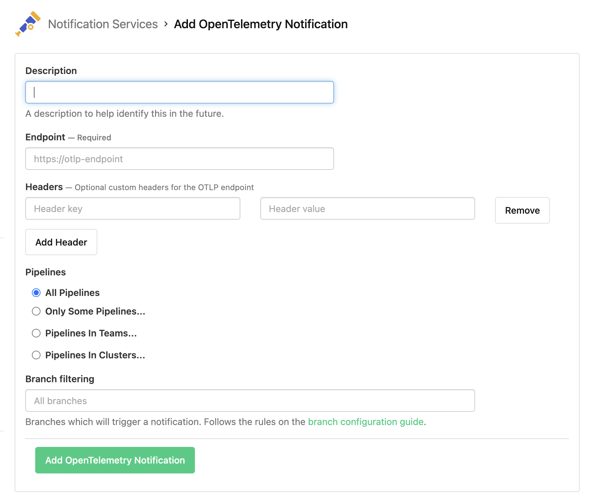

# OpenTelemetry Notification Service Examples

[](https://buildkite.com/organizations/~/services)

## Creating a new service

[Create a new OpenTelemetry Notification Service](https://buildkite.com/organizations/~/services/open_telemetry_tracing/new) in your organization's Notification Services settings (under Integrations).



## Endpoint

Please provide the base URL for your OTLP endpoint. Do not include the `/v1/traces` path as that automatically appended by the Buildkite OpenTelemetry exporter.

- We currently only support the [OTLP/HTTP](https://opentelemetry.io/docs/specs/otlp/#otlphttp) binary protobuf encoding.
- We currently only support sending trace data, but may introduce other OpenTelemetry signals in the future.
- The endpoint must be accessible over the internet.

## Headers

Add any additional HTTP headers to the request. Depending on the destination, you may need to specify API keys or other headers to influence the behaviour of the downstream collector.

Here are some common examples.

### Bearer token

Key: `Authorization`
Value: `Bearer <your-token>`

### Basic auth

Key: `Authorization`
Value: `Basic <base64(concat(<user>, <password>))>`

## Honeycomb

Set the Endpoint to `https://api.honeycomb.io`, or `https://api.eu1.honeycomb.io ` if your Honeycomb team is in the EU instance.

Add the require header:

| Key                | Value                 |
| ------------------ | --------------------- |
| `x-honeycomb-team` | `<Honeycomb API key>` |


For more information, see the honeycomb documentation: https://docs.honeycomb.io/send-data/opentelemetry/#using-the-honeycomb-opentelemetry-endpoint

## Datadog Agentless OpenTelemetry (Preview)

Endpoint: `https://trace.agent.datadoghq.com/api/v0.2/traces`

Add the required headers:

| Key              | Value               |
| ---------------- | ------------------- |
| `dd-protocol`    | `otlp`              |
| `dd-api-key`     | `<Datadog API key>` |
| `dd-otlp-source` | `${YOUR_SITE}`      |

Replace `${YOUR_SITE}` with the organization name you received from Datadog.

For more information, see the Datadog documentation: https://docs.datadoghq.com/opentelemetry/setup/agentless/traces/

## Propagating traces to Buildkite agents

See Buildkite documentation for OpenTelemetry tracing:
https://buildkite.com/docs/agent/v3/tracing#using-opentelemetry-tracing

Requires buildkite agent [v3.100](https://github.com/buildkite/agent/releases/tag/v3.100.0) or more recent.

### Required Agent Flags / Environment Variables

To propagate traces from the Buildkite backend through to the agent running the job, then include the following CLI flags to `buildkite-agent start` or use environment variables.

| Flag                              | Environment Variable                      |  Value                        |
| --------------------------------- | ----------------------------------------- | ----------------------------- |
| `--tracing-backend`               | `BUILDKITE_TRACING_BACKEND`               | `opentelemetry`               |
| `--tracing-propagate-traceparent` | `BUILDKITE_TRACING_PROPAGATE_TRACEPARENT` | `true`                        |
| `--tracing-service-name`          | `BUILDKITE_TRACING_SERVICE_NAME`          | `buildkite-agent` (default)   |
|                                   | `OTEL_EXPORTER_OTLP_ENDPOINT`             | `http://otel-collector:4317`  |
|                                   | `OTEL_EXPORTER_OTLP_HEADERS`              | `key1=value1,key2=value2`     |
|                                   | `OTEL_EXPORTER_OTLP_PROTOCOL`             | `grpc`                        |

### On Buildkite Hosted Agents

To export traces from hosted agents, this currently requires using a custom Agent Image

```dockerfile
# this is the same as --tracing-backend opentelemetry
ENV BUILDKITE_TRACING_BACKEND="opentelemetry"

# this is the same as --tracing-propagate-traceparent
ENV BUILDKITE_TRACING_PROPAGATE_TRACEPARENT="true"

# service name is configurable
ENV OTEL_SERVICE_NAME="buildkite-agent"

# the agent only supports GRPC transport
ENV OTEL_EXPORTER_OTLP_PROTOCOL="grpc"

# the GRPC transport requires a port to be specified in the URL
ENV OTEL_EXPORTER_OTLP_ENDPOINT="https://your-otel-endpoint:443"

# authentication of traces is done via tokens in headers
ENV OTEL_EXPORTER_OTLP_HEADERS="Authorization=Bearer <token>,x-my-header=value"
```

## OpenTelemetry Collector

The OpenTelemetry collector is an open source service for collecting, exporting and processing telemetry signals.

See [collector-config](./collector-config) for examples of OpenTelemetry collector configuration.

If using the `otel/opentelemetry-collector-contrib` image, you can configure the collector by mounting the your config file at `/etc/otelcol-contrib/config.yaml` or by overriding the `command` to `-config=env:OTEL_CONFIG` and setting the `OTEL_CONFIG` environment variable to the *contents* of your config file.

Consult the [Deployment](https://opentelemetry.io/docs/collector/deployment/) guide in the OpenTelemetry documentations for more information about hosting the collector.

### References

- https://opentelemetry.io/docs/collector/
- https://github.com/open-telemetry/opentelemetry-collector
- https://github.com/open-telemetry/opentelemetry-collector-contrib
- https://hub.docker.com/r/otel/opentelemetry-collector-contrib
